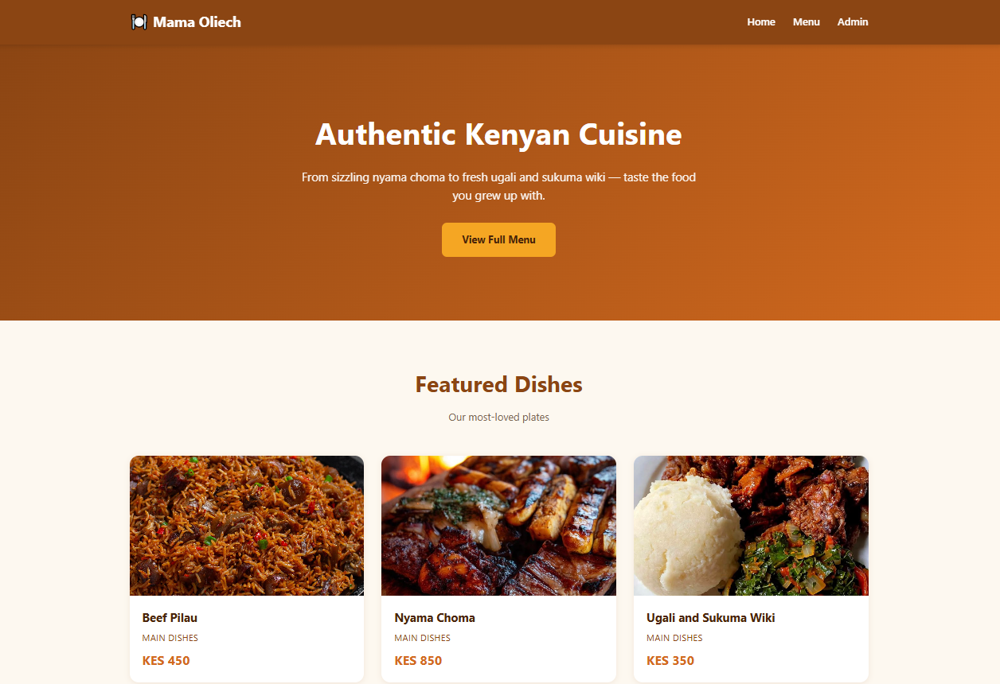
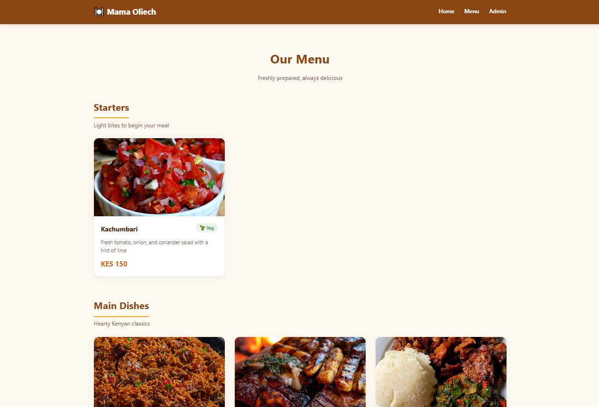
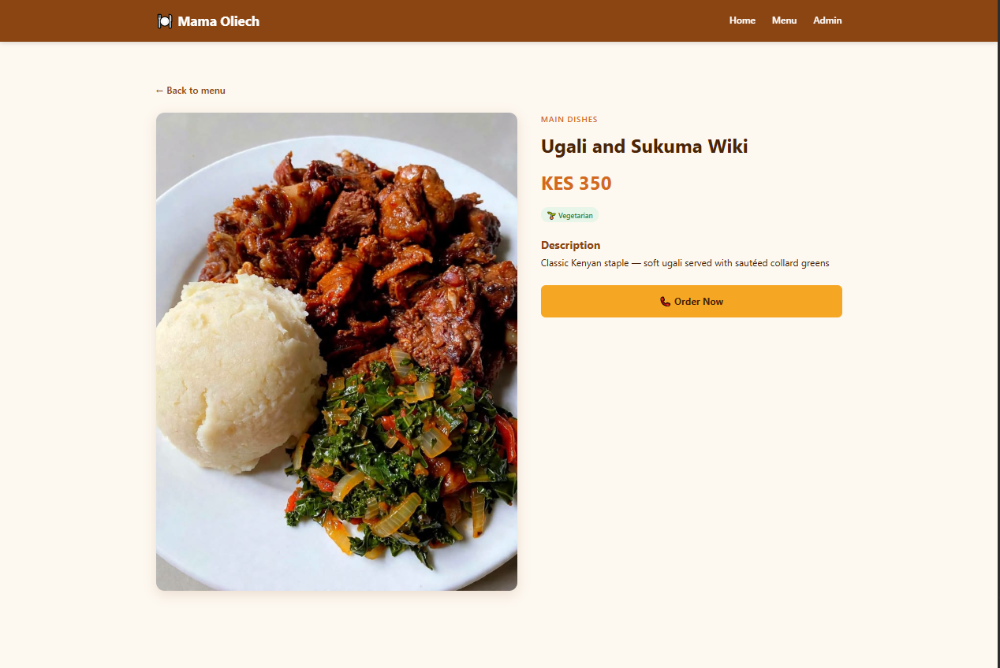

# 🍽️ Restaurant Menu Website

A restaurant menu website for Kenyan cuisine, built with Django and Python.


## Features

- 🍲 Browse menu by category (Starters, Mains, Sides, Desserts, Drinks)
- 📸 Dish detail pages with photos, descriptions, and prices in KES
- ⭐ Featured dishes highlighted on the homepage
- 🌱 Vegetarian and availability tags
- 🔧 Admin panel for restaurant staff to update the menu without touching code
- 📱 Mobile-friendly responsive design

## Tech Stack

- Python 3.12
- Django 6.1
- SQLite
- HTML5 / CSS3

## Screenshots

### Homepage


### Menu


### Dish Detail


## Setup

```bash
git clone https://github.com/sammshawn/restaurant-menu.git
cd restaurant-menu
python -m venv venv
venv\Scripts\activate       # Windows
pip install django Pillow
python manage.py migrate
python manage.py createsuperuser
python manage.py runserver